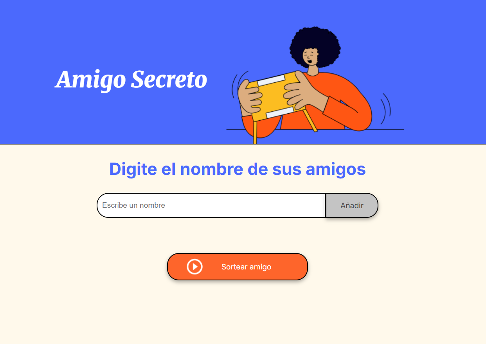
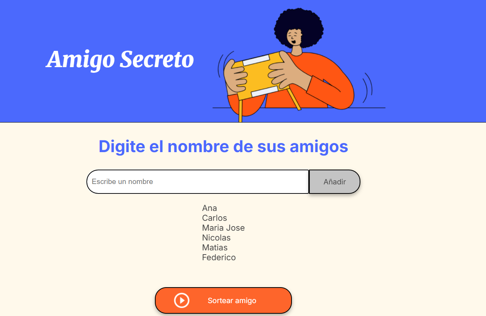
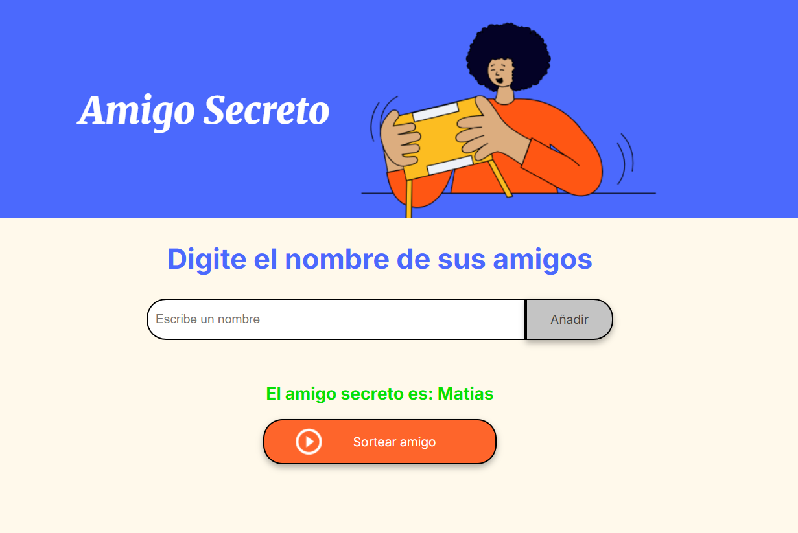

# 🎁 Challenge: Juego del Amigo Secreto

  

**Amigo Secreto** es una aplicación web interactiva que te ayuda a organizar de forma fácil el clásico juego de intercambio de regalos. Solo tienes que agregar los nombres de los participantes y la app se encarga de hacer el sorteo para que cada quien tenga su amigo secreto. ¡Así de simple!

## 🚀 Funcionalidades
- ⚠️ **Validación de entrada**: Si el campo de texto está vacío, la aplicación mostrará una alerta "Por favor ingrese un nombre" solicitando un nombre válido.
- 🚨 **Alerta cuando no hay amigos para sortear**: Si intentas sortear sin haber agregado nombres, recibirás un mensaje de advertencia que dice: "Por favor, inserte un nombre". Así, asegurarás que el juego tenga participantes antes de iniciar. ❌🎲
- 🚨 **Alerta cuando se ingresan dos nombres iguales**: Si intentas agregado nombres ingresado anteriormente, recibirás un mensaje de advertencia que dice: "Este nombre ya fue agregado, ingresa otro distinto". Así, asegurarás que el juego tenga participantes antes de iniciar. ❌🎲
- 🚨 **Alerta cuando se sortean menos de 2 amigos en la lista**: Si intentas realizar el sorteo sin la existencia de por lo menos 2 nombres, recibirás un mensaje de advertencia que dice: "Debe haber por lo menos 2 amigos para realizar el sorteo". Así, asegurarás que el juego tenga participantes antes de iniciar. ❌🎲
- ✏️ **Agregar nombres**: Permite a los usuarios ingresar el nombre de cada participante mediante un campo de texto y añadirlo a una lista.
- 📜 **Visualizar la lista**: Los nombres ingresados se mostrarán en una lista visible en la página, permitiendo verificar quiénes participarán.
- 🎲 **Sorteo aleatorio**: Al hacer clic en el botón "Sortear Amigo", la aplicación seleccionará aleatoriamente un nombre de la lista y mostrará el resultado en pantalla.

🏁🎊

## 🖼️ Capturas de Pantalla

1. **Pantalla Principal**: Inicio de la aplicación donde se pueden agregar los nombres de los participantes en el campo correspondiente.

   

3. **Lista de Participantes**: Los nombres añadidos a la lista se van mostrando en la pantalla.
   
   

4. **Resultado del Sorteo**: El nombre del amigo secreto seleccionado aleatoriamente se muestra en pantalla.
   
   


## 🛠️ Tecnologías Utilizadas

- **HTML5**: Estructura y contenido de la aplicación.
- **CSS3**: Estilos y diseño visual.
- **JavaScript**: Funcionalidad e interactividad.

## 📦 Instalación

Para ejecutar esta aplicación en tu entorno local, sigue estos pasos:

1. **Clona este repositorio**:

   ```bash
   git clone https://github.com/marozta/Alura-ONE-G9-Challenge-Amigo-Secreto.git
   ```

2. **Abre el archivo `index.html` en tu navegador**.

   Es una aplicación web estática, puede usarse sin necesidad de instalaciones adicionales.

## 💻 Uso

1. **Ingresa el nombre** de un participante en el campo de texto.
2. **Haz clic en "Adicionar"** para agregar el nombre a la lista.
3. Repite los pasos anteriores hasta que todos los participantes estén en la lista.
4. **Haz clic en "Sortear Amigo"** para sortear el nombre del amigo secreto.


---

¡Gracias por descargar **Amigo Secreto**! Esperamos que te ayude a organizar mejor tus sorteos. 🎉